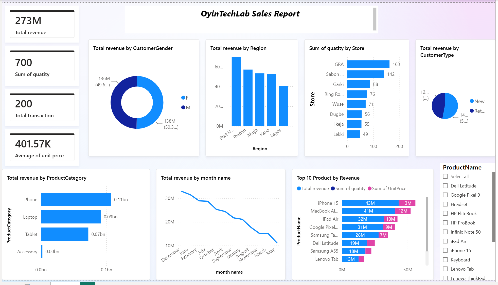

# Retail Sales Performance Analysis

## Overview
This project analyzes anonymized transactional data from a retail chain operating
across five Nigerian cities (Port Harcourt, Ibadan, Abuja, Kano, Lagos), covering
200 transactions and 700 units sold across four product categories — Phones,
Laptops, Tablets, and Accessories — over a two-year period (2025–2026). The goal
was to give leadership a single view of where revenue is concentrated, which
stores and segments are underperforming, and where to focus inventory or
expansion decisions.

## Business Problem
The client — a multi-city retail chain — needed answers to:
1. Which regions and stores are driving revenue, and which are lagging?
2. Which product categories and specific products should be prioritized in stock and marketing?
3. Are new or returning customers driving more value, and does that differ by gender?
4. Are any stores selling high volume but low value (or vice versa), which would change how their performance should be judged?

Without a consolidated dashboard, this data existed as raw transaction records
with no way to compare regions, track top performers, or spot mismatches between
volume and revenue at a glance.

## Dashboard Preview


## Key Insights
- **Total revenue of ₦273,213,000** across 200 transactions and 700 units sold,
  averaging ₦401,570 per unit.
- **Port Harcourt is the top-performing region** (₦69.72M), roughly 72% higher
  than the lowest-performing region, Lagos (₦40.51M).
- **GRA is the top store by both volume and revenue** (163 units, ₦69.72M) —
  nearly double the volume of the lowest-performing store, Lekki (49 units).
- **Volume and revenue don't always align**: Ikeja has more units sold than Lekki
  (55 vs. 49) but generates less revenue (₦17.97M vs. ₦22.54M) — meaning Lekki
  sells fewer but higher-value items, while Ikeja moves more low-value stock.
  Judging store performance by volume alone would misread this.
- **Phones are the leading category** (₦107.06M), followed by Laptops (₦91.29M)
  and Tablets (₦72.48M). Accessories are negligible (₦2.38M) — a candidate for
  reduced shelf space or a bundling strategy rather than standalone stocking.
- **iPhone 15 is the single best-selling product** (₦43.12M), narrowly ahead of
  MacBook Air M4 (₦40.6M); together the top 2 products account for over 30% of
  total revenue.
- **Customer base is close to evenly split** by gender (50.3% female / 49.7% male),
  suggesting broad-based rather than heavily gender-targeted marketing is likely
  more effective. New customers (53.1%) slightly outweigh returning customers
  (46.9% of revenue) — worth monitoring alongside retention efforts.

## Recommendations
- Investigate why Lekki and Ikeja underperform relative to GRA and Sabon Gari —
  and treat them differently: Lekki may benefit from more foot traffic or
  awareness (it already sells high-value items well), while Ikeja may need a
  push toward higher-margin products rather than more volume.
- Reallocate marketing and inventory investment toward Phones and Laptops, which
  drive the bulk of revenue, while reassessing whether Accessories justify
  independent stocking.
- Because the dataset spans two years (2025–2026), month-over-month comparisons
  should be done by calendar month *and* year — not month name alone — to avoid
  drawing false seasonal conclusions from data that blends two different years.

## Tools & Skills Used
- **Power BI**: data modeling, DAX measures, Top N filtering, drill-through,
  conditional formatting, interactive dashboard design
- **Excel**: data cleaning, PivotTables, formula-based validation
- **Power Query**: column renaming, data type correction, error handling

## Methodology

### Data Cleaning
- Validated `SaleID` uniqueness and checked for duplicate transaction records
- Corrected data types (dates, currency, numeric fields) in Power Query
- Built a dedicated Date table to support time-intelligence and correct
  chronological sorting (month name sorted by month number, not alphabetically)

### Key DAX Measures

```dax
Total Revenue = SUMX(Retail_Sales_200, Retail_Sales_200[Quantity] * Retail_Sales_200[UnitPrice])

Total Transactions = DISTINCTCOUNT(Retail_Sales_200[SaleID])

Average Unit Price = AVERAGE(Retail_Sales_200[UnitPrice])

Month Number = MONTH('Date'[Date])
```

- Applied **Top N filtering** (Top 10 by Total Revenue) on the product-level chart
  to surface best-sellers without cluttering the visual
- Used **Sort by Column** (Month Number → Month Name) so the monthly chart reads
  in calendar order rather than alphabetically or by magnitude

### A Note on Data Limitations
The dataset spans two calendar years (2025–2026) aggregated by month name only.
This means month-to-month comparisons in this version of the dashboard reflect a
blend of both years rather than a true single-year seasonal trend. A future
iteration should separate revenue by year to properly assess seasonality.

## Files in This Repository
- `data/Oyin_Tech_Lab_Sales_Report.xlsx` — cleaned dataset
- `powerbi/OyinTechLab_Sales_Report.pbix` — full Power BI report file
- `images/dashboard_screenshot.png` — dashboard preview
- `docs/Retail_Sales_Case_Study.docx` — detailed case study write-up

- 
## Author
**Alabi Maryam Oyinkansola**
Data Analyst | [GitHub](https://github.com/OyinTechLab) | oyintechlab@gmail.com
